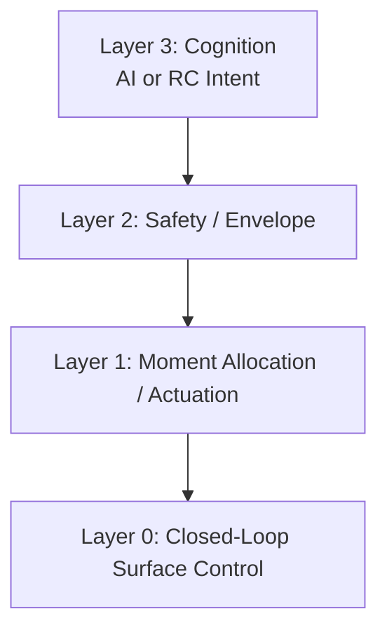

# Symmetric Rigid Body Maneuvering (SRBM)

---------------------------------------------------------------------

## Why SRBM Exists

Modern autonomous systems fail because the interface between cognition and physics is undefined.
Every new airframe forces a software rewrite.
Every actuator layout requires custom logic.
Every tactical model becomes brittle when exposed to real aerodynamics.

SRBM eliminates this failure mode by defining a strict, airframe-agnostic
six-degree-of-freedom contract between:

- what the AI wants to do
- what physics allows
- how the vehicle actually produces motion

SRBM is not a controller, not a UAV design, and not a tactics engine.
It is a prompt template for machine intelligence, expressed in physics instead of text.

---------------------------------------------------------------------

## What SRBM Is

SRBM is a control-virtualization architecture that turns any controllable rigid body
into a machine-native substrate for autonomous maneuvering.

It defines a clean, three-layer handshake:

1. Layer 3 - Cognition  
   The AI outputs idealized rigid-body intent.

2. Layer 2 - Safety  
   Deterministic feasibility, envelope enforcement, and constraint management.

3. Layer 1 - Hardware  
   Moment allocation, actuator realization, and disturbance rejection.

This boundary allows autonomy to operate on a stable, geometry-agnostic abstraction.

---------------------------------------------------------------------

## SRBM as a Prompt Template for Machine Intelligence

Modern AI systems operate best when given:

- a fixed output schema
- a deterministic rule engine
- a decoder that interprets tokens into actions

SRBM mirrors this structure:

- rigid-body vector (p, q, r, T, B) = output schema
- feasibility projection = rule engine
- moment allocation = token interpreter

The result is a machine-native prompt format that constrains AI behavior
inside a mathematically defined six-degree-of-freedom sandbox.

---------------------------------------------------------------------

## How to Read This Document

SRBM is **not** a flight controller, **not** a UAV design, and **not** a tactical AI model.  
It is a **co-design architecture** that defines the contract between cognition, safety, and hardware.

This specification must be read as an **operating-system–level abstraction**, not as an aircraft-specific control law.  
SRBM introduces a rigid-body virtualization boundary that cleanly separates:

- **Layer 3 — Cognition:** idealized rigid-body intent, independent of geometry or aerodynamics  
- **Layer 2 — Safety:** deterministic feasibility, envelope enforcement, constraint management  
- **Layer 1 — Hardware:** moment allocation, actuator realization, disturbance rejection

The goal is to separate *what the AI wants to do* from *how the vehicle physically does it*.  
SRBM is therefore a blueprint for **AI–hardware co-design**, enabling portable autonomy across any controllable rigid body.

If you read this document with that framing, the architecture becomes universal, modular, and intentionally airframe-agnostic.

---

SRBM is an open, airframe-agnostic architectural framework for autonomous maneuvering systems.

SRBM is a **control-virtualization architecture** that allows autonomous systems to reason in terms of idealized rigid-body motion while deterministic lower layers enforce safety, feasibility, and hardware realization.

Originally motivated by autonomous air combat, the architecture applies to any vehicle that can be represented as a controllable rigid body, including aircraft, spacecraft, missiles, submarines, and other robotic systems.

---

## Core Thesis

Modern autonomy is often forced to reason in platform-specific implementation details:

- aerodynamic coefficients
- control-surface topology
- actuator dynamics
- structural limits
- propulsion architecture

This tightly couples cognition to a particular vehicle and makes transferring autonomy between platforms difficult.

SRBM introduces a virtualization boundary between cognition and physics.

The cognitive layer issues rigid-body intent.

Deterministic lower layers enforce safety and realize that intent on a specific vehicle.

As a result, autonomy can operate on a stable, geometry-agnostic abstraction rather than the underlying implementation.

---

## Table of Contents

- [Start Here: The SRBM Virtual Nervous System](#start-here-the-srbm-virtual-nervous-system)
- [What Problem SRBM Solves](#what-problem-srbm-solves)
- [Architectural Overview](#architectural-overview)
  - [Layer 3 — Cognition (Motor Cortex)](#layer-3--cognition-motor-cortex)
  - [Layer 2 — Proprioception (Vestibular-System)](#layer-2--proprioception-vestibular-system)
  - [Layer 1 — Reflex Arc (Spinal Loop)](#layer-1--reflex-arc-spinal-loop)

---

# Start Here: The SRBM Virtual Nervous System

For readers new to SRBM, begin with the conceptual overview:

➡️ **[SRBM Virtual Nervous System Overview](docs/SRBM_Virtual_Nervous_System_Overview.md)**

For complete technical details:

📄 **[SRBM Complete Specification (PDF)](docs/SRBM_Complete_Specification.pdf)**

The Virtual Nervous System introduces the architecture through a biological analogy.

---

# Architectural Overview

## Layer 3 — Cognition (Motor Cortex)

- Tactical intent generation
- Latent doctrine blending
- α/γ doctrine manifold
- Airframe-agnostic motion reasoning

## Layer 2 — Proprioception (Vestibular System)

- Envelope enforcement
- Feasibility projection
- Constraint management
- Deterministic safety guarantees

## Layer 1 — Reflex Arc (Spinal Loop)

- High-rate moment allocation
- Actuator authorization
- Disturbance rejection
- Motion realization

Together these layers transform a physical vehicle into a virtualized rigid-body substrate suitable for machine-native maneuvering.

---

# What Problem SRBM Solves

Many autonomy systems attempt to solve tactical reasoning and physical control simultaneously.

As a result, cognitive policies often become coupled to:

- actuator layouts
- aerodynamic behavior
- propulsion configurations
- platform-specific constraints

This creates a significant AI-to-reality challenge.

SRBM addresses this by separating responsibilities:

| Layer | Responsibility |
|-------|----------------|
| **Layer 3** | Determine desired motion |
| **Layer 2** | Determine safe motion |
| **Layer 1** | Determine how motion is physically produced |

The tactical policy no longer reasons about actuators, control surfaces, or aerodynamic implementation.

Instead, it operates on an idealized rigid-body abstraction.

## Final Note

SRBM is an open, airframe-agnostic, machine-native interface contract.
It accelerates research, simplifies co-design, and makes autonomy portable
across any controllable rigid body.

If you understand the boundary, you understand the architecture.

## 📘 How to Cite SRBM

If you use SRBM in research, teaching, or technical work, please cite it as follows:

**Wertz, D. M. (2026). _Symmetric Rigid Body Maneuvering (SRBM):  
An AI‑Native Architecture for Autonomous Air Combat._ Version 1.0.**

~~~bibtex
@misc{wertz2026srbm,
  title        = {Symmetric Rigid Body Maneuvering (SRBM):
                  An AI-Native Architecture for Autonomous Air Combat},
  author       = {Wertz, Duane M.},
  year         = {2026},
  month        = {June},
  version      = {1.0},
  howpublished = {\url{https://github.com/wertz01/srbm}},
  note         = {Top-level architectural specification and supporting documents}
}
~~~

